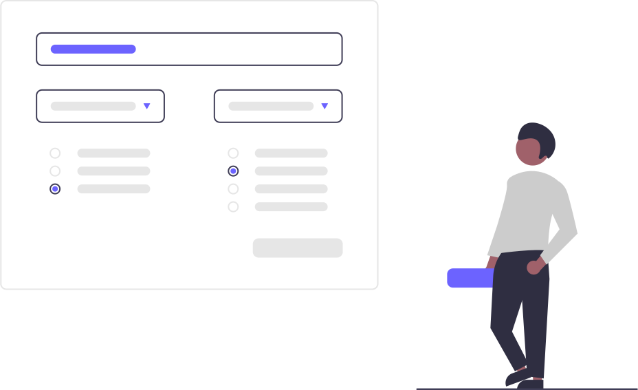

Los formularios son una forma de interacción con el usuario muy importante, ya que se utilizan para registros, inicios de sesión, o el envio de cualquier tipo de información.

- Todos los campos deben ser accesibles mediante **tabulación.**
- Todo los los controles de formulario (input, textarea, select), deben tener **asociado un label**, o en su defecto, el atributo aria-label
- **Resalta los campos cuando se haga foco** sobre ellos.
- Los campos obligatorios deben quedar claramente marcados (asterisco, texto descriptivo, etc)
- Ofrece espacio suficiente entre campos y **zonas clickables amplias**.
- **Ofrece tiempo suficiente para completar** un formulario (caducidad de sesión).
- Usa **autocompletado** en campos de búsqueda.
- Cuando se envíe los datos de un formulario, **informa al usuario de la acción realizada,** para formularios complejos, es útil mostrar una página de **confirmación de la información facilitada** antes de enviarla.
- **Ofrece ayuda e información complementaria** para rellenar campos que puedan ser complejos.

## Label

La etiqueta `<label>` representa el título de un elemento de control de formulario.

### Asociar label

Las etiquetas `<label>` deben asociarse de forma implícita o explícita a los distintos controladores de formulario (input, textarea, select).

#### Asociación implícita

La etiqueta `<label>` engloba a su control asociado.

```html
<label
  >Nombre:
  <input type="text" id="nombre" name="nombre" />
</label>
```

#### Asociación explícita

Añadimos el atributo `for=''` con el id del control asociado a la etiqueta `<label>`.

```html
<label for="nombre">Nombre:</label>
<input type="text" id="nombre" name="nombre" />
```

:::tip
Recuerda que el id debe ser único en cada página, por eso te recomendamos la asociación implícita en formularios con muchos campos.
:::

## Instrucciones adicionales

Es aconsejable proporcionar ayuda en los campos que puedan ofrecer dudas de introducción.

### Placeholder

Con los placeholder mostraremos un texto dentro de los campos `input` o `textarea`, recuerda que **no debe reemplazar a un label**.

```html
<label for="name">Nombre completo: </label>
<input
  type="text"
  name="name"
  id="name"
  placeholder="Escriba su nombre y apellidos"
/>
```

Con css es posible modificar el **estilo del placeholder**:

```css
::placeholder {
  /* Chrome, Firefox, Opera, Safari 10.1+ */
  color: red;
  opacity: 1; /* Firefox */
}
```

### Dentro del label

Podemos ofrecer ayuda dentro de nuestro label, por ejemplo el formato requerido:

```html
<label for="expire">Fecha de caducidad (MM/AAAA): </label>
<input type="text" name="expire" id="expire" />
```

### Fuera del label

Podemos hacer uso del atributo WAI-ARIA `aria-labelledby` o `aria-describedby`.

```html
<!-- aria-labelledby -->
<label id="expLabel" for="expire" tabindex="-1">Fecha de caducidad:</label>
<span>
  <input
    type="text"
    name="expire"
    id="expire"
    aria-labelledby="expLabel expDesc"
  />
  <span id="expDesc" tabindex="-1">MM/AAAA</span>
</span>

<!-- aria-describedby -->
<label id="expLabel" for="expire">Fecha de caducidad:</label>
<span>
  <input
    type="text"
    name="expire"
    id="expire"
    aria-labelledby="expLabel"
    aria-describedby="expDesc"
  />
  <span id="expDesc">MM/AAAA</span>
</span>
```

## Input y textarea

Los elementos input deben llevar su type correspondiente.

```html
<input type="button" />
<input type="checkbox" />
<input type="color" />
<input type="date" />
<input type="datetime-local" />
<input type="email" />
<input type="file" />
<input type="hidden" />
<input type="image" />
<input type="month" />
<input type="number" />
<input type="password" />
<input type="radio" />
<input type="range" />
<input type="reset" />
<input type="search" />
<input type="submit" />
<input type="tel" />
<input type="text" />
<input type="time" />
<input type="url" />
<input type="week" />
```

### Emulando con WAI-ARIA

Tanto los input y los textarea se pueden emular mediante WAI-ARIA, aunque siempre lo usaremos como última opción:

```html
<!-- campo input simple -->
<div id="txtboxLabel">Código postal:</div>
<div
  role="textbox"
  contenteditable="true"
  aria-placeholder="5-digit zipcode"
  aria-labelledby="txtboxLabel"
></div>

<!-- campo textarea -->
<div id="txtboxMultilineLabel">Comentarios:</div>
<div
  role="textbox"
  contenteditable="true"
  aria-multiline="true"
  aria-labelledby="txtboxMultilineLabel"
  aria-required="true"
></div>
```

## Fieldset y legend

Usa la etiqueta `fieldset` para englobar los distintos apartados, y a su vez la etiqueta `legend` para añadir un título.

```html
<fieldset>
  <legend>Informacion personal</legend>
  <!-- campos de información personal -->
</fieldset>
```

## Checkbox y radio button

- Agrupa los radiobutton o checkbox dentro de un fieldset.
- Añade un legend para proporcionar una descripción para la agrupación, esta debe ser corta y descriptiva.

```html
<fieldset>
  <legend>¿Cuál es tu color preferido?</legend>
  <div class="checkbox column">
    <input id="rojo" type="checkbox" name="color" value="rojo" />
    <label for="rojo">Rojo</label>
    <input id="azul" type="checkbox" name="color" value="azul" />
    <label for="azul">Azul</label>
    <input id="verde" type="checkbox" name="color" value="verde" />
    <label for="verde">Verde</label>
  </div>
</fieldset>
```

- Como alternativa al fieldset, podemos usar WAI-ARIA, añadiendo al div contenedor los atributos role="group" y aria-labelledby.

```html
<div role="group" aria-labelledby="color_head">
  <h4 id="color_head" class="bold">¿Cuál es tu color favorito</h4>
  <div class="row">
    <input id="rojo" type="checkbox" name="color" value="rojo" />
    <label for="rojo">Rojo</label>
    <input id="azul" type="checkbox" name="color" value="azul" />
    <label for="azul">Azul</label>
    <input id="verde" type="checkbox" name="color" value="verde" />
    <label for="verde">Verde</label>
  </div>
</div>
```

## Switch

Los switch o toggles, deben incluir el atributo `role="switch"` y `aria-pressed` con el valor `"true, false o mixed"`, dependiendo de su estado.

```html
  <div>
    <button type="button" id="toggle_label" aria-labelledby="toggle_label" aria-checked="false" role="switch">
      <span></span>
    </button>
    <label for="toggle_label">Recordar sesión</label>
  </div>
```

## Select

- Utiliza el atributo TITLE para proporcionar ayuda contextual en los controles del formulario.
- Proporciona un orden de tabulación lógico mediante tabindex cuando el de por defecto no es suficiente.
