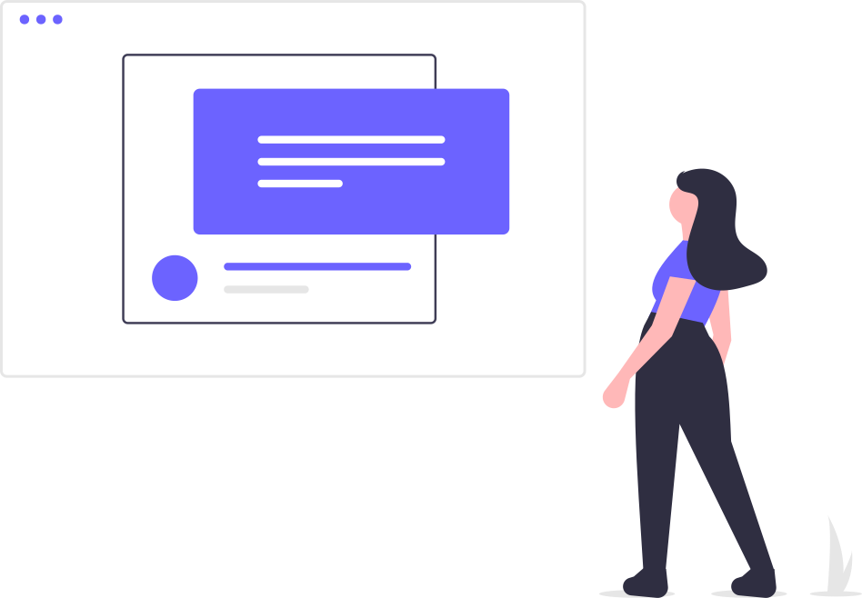

Los modales siempre han sido problematicos en accesibilidad, te recomendamos usarlos sólo en casos donde sean necesarios.

- **No abrir modales de forma automática**, es decir, si el usuario no ha realizado ningún acción.
- Añadir `role="dialog"` o bien usar etiqueta `dialog`
- Cuando abrimos un modal, **debemos bloquear todo el contenido que esté detrás** y poner el foco sobre el primer campo si lo tuviera.
- Se debe poder cerrar con la tecla `Esc` o bien pulsando un botón de cierre.
- Una vez cerrado, el foco debe volver al **punto donde se lanzó el modal**.
- Si usamos la etiqueta `<dialog>`, añadiremos el atributo `open` cuando está visible.


## Uso dialog

https://www.w3.org/TR/wai-aria-practices/examples/dialog-modal/dialog.html


```html
<dialog open>Esto es un modal abierto</dialog>
```

> firefox aún no ofrece soporte por defecto. https://www.w3schools.com/tags/tag_dialog.asp

