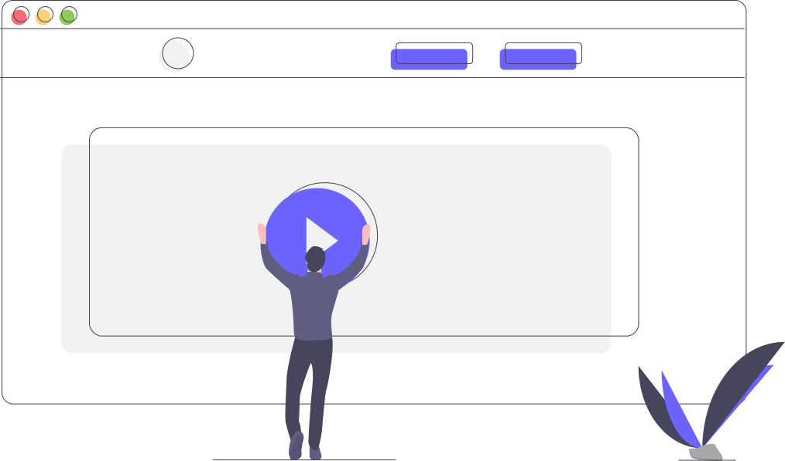

 

### SVG

Para svg decorativos, añadir aria-hidden="true"
Añade focusable="false" si está dentro de un elemento focusabe, como un botón.
Para aseguranos la compatibilidad con lectores, añadir atributo `role="img"`
SVG en línea, debemos añadir un title y desc si fuera necesario.

```html
<svg role="img">
    <title>Título del svg</title>
    <desc>Una descripción de la imagen svg.</desc>
...
</svg>
```

## Video / Audio

- **No uses autoplay**
- Añade una **transcripción y subtitulos**, con esto además mejoramos el SEO.
- Los subtitulos **deben tener un tamaño, duración y contraste adecuado**, y durar lo suficiente para su lectura.
- Todo los **controles deben ser accesibles mediante teclado.**
- Evita los parpadeos, no más de tres flashes en un período de 1 segundo.

```html
<video class="video" poster="portada-video.jpg" controls title="Mi portada">
    <source  src="your-video.m4v" type='video/mp4; codecs="avc1.42E01E, mp4a.40.2"' />
    <source  src="your-video.ogg" type='application/ogg' />
    <source  src="your-video.webm" type='video/webm' />
    <track src="your-video-transcript.vtt" label="English Captions" kind="subtitles" srclang="en-us" default />
</video>
```