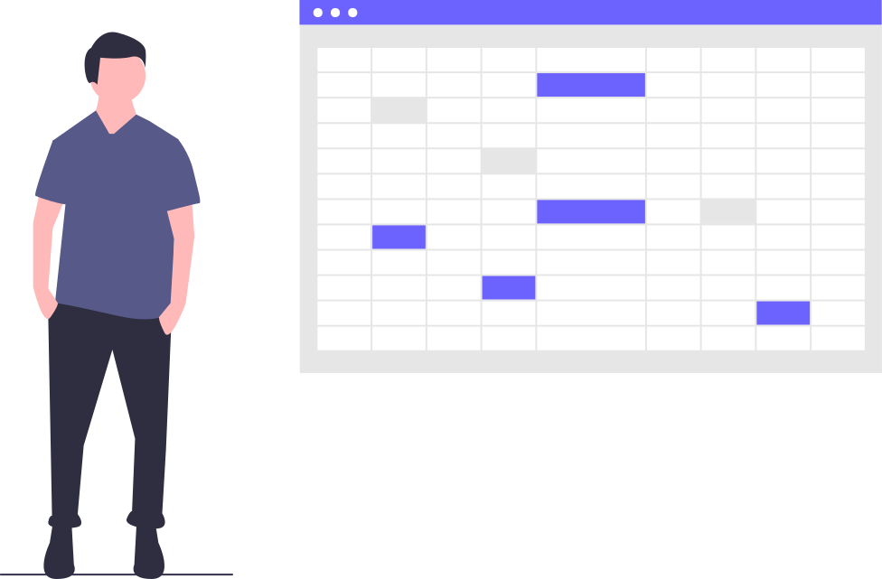

 

Usaremos las tablas siempre que mostremos datos tabulares, es decir en filas y columnas.

- Añadir un título que defina brevemente el contenido de la tabla mediante la etiqueta `caption`, o en su defecto usar `aria-describedby`.
- Se debe utilizar el atributo `scope` dentro de un `th`, para indicar si está encabezando una columna `<th scope='col'>` o una fila `<th scope='row'>`.
- Intentar evitar el scroll horizontal, es preferible que la tabla crezca verticalmente.